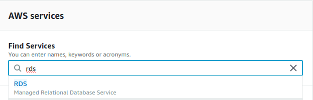

# Tutorial  
 
## Description 
 
Tutorial de capacitación en la construcción de sitios web dinámicos y estáticos sonde AWS 
  
###  
#### 1 Desplegar un sitio estático usando S3 
Empezaremos por buscar el servicio S3 entre la lista de servicios ofrecidos en la consola de AWS 
 
    
  
Seleccionaremos _Create bucket_ 
 
    
 
Se desplegara el siguiente modal en el cual colocaremos la información básica del bucket de S3 
 
    
 
Procederemos con las opciones de configuración, es esta pestana dejaremos todo por defecto 
  
   
  
Acá configuraremos la seguridad y permisos del bucket de S3, deshabilitaremos todas las casillas para no bloquear el acceso publico 
  
   
  
La ultima ventana nos muestra un resumen de la configuración con la cual se creará el bucket, procedemos a crearlo. 
  
   
  
Una vez creado lo seleccionaremos y procederemos a subir el directorio de nuestro sitio web estático. 
  
   
  
   
  
Una vez subidos todos los archivos modificaremos las reglas y permiso para que todos los elementos en el bucket sean de acceso público, 
para ello nos dirigiremos a la pestaña _Bucket Policy_, ahí se encuentra una consola la cual nos permite agregar configuraciones (ARN) sobre el bucket colocaremos ahí la siguiente configuración que permite el acceso público a todos los elementos en el bucket 
``` 
{ 
    "Version": "2012-10-17", 
    "Statement": [ 
        { 
            "Sid": "AddPerm", 
            "Effect": "Allow", 
            "Principal": "*", 
            "Action": "s3:GetObject", 
            "Resource": "arn:aws:s3:::arep-web-side/*" 
        } 
    ] 
} 
``` 
 
    
 
Ahora que los archivos son públicos procedemos a habilitar el hosting para sitios web estáticos que provee AWS 
esto lo aremos en la pestaña _Properties_ colocaremos cual va a ser el archivo que se enrutará al '/' como home de nuestra página, esté archivo debe estar en la raíz del bucket  
 
   
  
Una vez habilitado podremos acceder al sitio estático con todas las funcionalidades CSS, HTML, JS 
  
   
  
**[Video demostrativo del funcionamiento](video/s3_arep.mp4)**
  
#### 2 Crear servidor Java usando EC2 que sea capaz de consumir una DB 
Iniciaremos por crear un proyecto Spring a partir de [Spring Initializr](https://start.spring.io) seleccionaremos Maven como project, Gradle es igualmente valido, seleccionaremos el  _Group_ y _Artifact_ de nuestro gusto, 
En la sección de dependencias agregaremos 2 dependencias extra, *Spring Web* y *Spring Data JDBC* luego explicaremos el uso de estas dependencias. 
  
   
  
Agregaremos de forma manual 3 dependencia extra, *Tomcat-jdbc* que prove una implementacion de DataSource que usaremos luego, *Flyway-core* que nos provee un sistema de versionamiento y migraciones sobre nuestra DB y el driver de Postgres *postgresql* 
  
   
  
Empezaremos con agregar la configuración de para realizar la conexión a la base de datos postgres desde el `application.properties` el prefijo _spring.datasource_ es el estándar usado por Spring, 
Esto va a permitir que muchos de los Bean sean creados automáticamente por la configuración por defecto de Spring 
 
    
 
Luego crearemos una clase de configuración que se encargue de crear los bean extra que necesitaremos. El primero DataSource proverá la configuracion de la fuente de datos, note que estamos creando una instancia de `org.apache.tomcat.jdbc.pool.DataSource` este lo usara _Flyway_ y el bean `SimpleJdbcInsert`, 
Usaremos la anotacion `@ConfigurationProperties` con el prefijo para que Spring se encargue de configurar el Bean con las credenciales, driver y URLproporcionadas en el `application.properties`, el segundo bean es uno que permite hacer inserciones sobre la base de datos generando un por debajo el código SQL para realizar la inserción y hacuendo uso de un `JdbcTemplate` en este caso usaremos la configuración por defecto de Spring `NamedParameterJdbcTemplate`.  
 
   
  
Ahora procederemos a crear la estructura del proyecto, crearemos 3 capas _Controller_ encargada de la lógica relacionada a el protocolo de transporte de peticiones REST HTTP, _Service_ encargada de manear la logica y procesamiento de datos, _Repository_ encargada de extraer de las fuentes de información los datos a la capa superior. 
Para este tutorial solo crearemos un simple CRUD sobre una clase User a modo de ejemplo e iremos pasando capa a capa desde la capa baja. 
  
   
  
* **Modelo de datos**: 
En la carpeta resourse crearemos una carpeta para las migraciones, esta carpeta será usada por [Flyway](https://flywaydb.org) para manejar el versionamiento de la base de datos, Flyway creara una tabla (_flayway_schema_history_) en la cual se va a llevar el registro de la versión en la que se encuentra la base de datos y determinará si hace falta ejecutar alguna migración 
Flyway ejecuta las migraciones pertinentes al iniciar el servicio, la primera migración va a crear la tabla de usuarios. 
  
   
 
* **Entidad User**: 
Describe el POJO de un usuario con las propiedades id, name, lastName, getters y setters correspondientes para estas propiedades. 
Además, define metadata que se usó en la configuración de el Bean `SimpleJdbcInsert` que indica el nombre de la tabla en la que se va almacenar esta entidad, y cual es la propiedad que se usa como identificador, la función toMap convierte la entidad a su representación en Map esto se usara para realizar inserciones con `SimpleJdbcInsert`. 
  
   
  
* **Repository**: 
Usaremos inyección de dependencias a través del constructor para inyectar los beans `NamedParameterJdbcTemplate` y `SimpleJdbcInsert`, con estos dos realizaremos las funciones para consultar e insertar, además al final de la clase se definen las queries que se usaran para consultar, por simplicidad del tutorial se colocaron como String implícitos en codigo,  
pero es posible colocarlo en un archivo separado en la carpeta _resources_ y luego leyendo el archivo a través un `ResourceLoader` con el classpath correspondiente. 
  
    
 
* **Service**: 
Esta capa simplemente servirá de puente entre las capas controlador y repositorio, ya que nuestro servicio no tiene lógica adicional que deba manejarse acá. 
  
   
  
* **Controller**: 
Acá definiremos los métodos y los endpoints que expondrá el servicio, la aplicación será un REST API que permitirá almacenar un usuario y consultarlos. 
Está clase se apoya en la clase `Router` la cual simplemente es una clase con constantes de las URLs. 
  
   
    
   
    
Adicionalmente agregaremos un controlador extra con el fin de mostrar una página Web que nos va a dar una interfaz para hablar con el otro controlador encargado de los usuarios, solo va a tener un método que va a retornar un String con el código HTML de la pagina 
   
   
    
  ``` 
      <html lang="en"> 
      <head> 
          <meta charset="UTF-8"> 
          <title>Users app</title> 
      </head> 
      <script src="https://unpkg.com/axios/dist/axios.min.js"></script> 
      <script type="text/javascript"> 
          function submitForm() { 
              var name = document.getElementById('name').value; 
              var lastName = document.getElementById('lastName').value; 
              var headers = {'Content-Type': 'application/json'}; 
              var Url = "/user"; 
              var body = {"name": name,"last_name": lastName}; 
              axios({ 
                  method: 'post', 
                  url: Url, 
                  data: body 
              }).then(data => document.getElementById('response').innerHTML = "Response: " + JSON.stringify(data.data)) 
          .catch(err => alert(err)); 
          } 
          function search() { 
              var id = document.getElementById('id').value; 
              var headers = {'Content-Type': 'application/json'}; 
              var Url = "/user/" + id; 
              axios({ 
                  method: 'get', 
                  url: Url, 
              }).then(data => document.getElementById('response').innerHTML = "Response: " + JSON.stringify(data.data)) 
          .catch(err => alert(err)); 
          } 
       
     </script> 
       
     <body bgcolor="#afafaf"> 
      <center> 
          <h4>Users App Demo</h4> 
          <input id="name" type="text" placeholder="Name" onsubmit="submitForm()"/><br><br> 
          <input id="lastName" type="text" placeholder="Last name" onsubmit="submitForm()"/><br><br> 
          <input type="button" value="save" onclick="submitForm()"/><br><br> 
          <input id="id" type="text" placeholder="Id (Empty searchAll)" onsubmit="search()"/><br><br> 
          <input type="button" value="search" onclick="search()"/><br><br> 
          <label id="response"></label> 
      </center> 
      </body> 
      </html> 
   ``` 
 
#### 3 Creación de un RDS en AWS 
Primero accederemos a la consola de AWS y buscaremos **RDS** 
    
  
Seleccionaremos ***Create Database*** y ahí seleccionamos _Easy Create_ para que se cree con la configuración por defecto 
  
   
    
Seleccionamos el motor de base de datos, en este caso PostgreSQL. 
    
   
    
Por último, colocamos un nombre que identifique la base de datos, y las credenciales de acceso. 
    
   
 
Ahora esperamos unos minutos a que AWS cree, suba y configure la instancia de la base de datos. 
Una vez acabado el proceso nos indicara que ya está disponible: 
  
   
   
#### 4 Creación de una instancia EC2 en AWS 
 
Ahora crearemos una instancia de EC2 en AWS, para esto accederemos a la consola AWS y buscaremos **EC2**, seleccionaremos _Launch Instance_ 
 
    
  
Seleccionaremos una imagen de la máquina que deseamos crear, seleccionaremos la primera. 
  
   
    
Luego seleccionamos el tipo de maquina en términos de capacidad queremos crear. 
    
   
    
Saltaremos con la configuración por defecto hasta el paso 6 en el cual vamos a definir el grupo de seguridad de la instancia EC2, crearemos un nuevo grupo y agregaremos más puertos a las conexiones entrantes 
Estos puertos son para permitir peticiones entrantes de nuestro servidor Spring que se levanta usando tomcat que por defecto ocupa el puerto 8080, y la conexión con la base de datos PostgreSQL, el primero puerto es el que nos permite establecer una conexión remota por SSH a la maquina por lo que es importante dejarlo. 
    
   
    
Procederemos a crear la máquina, daremos en el boton _Launch_ 
  
   
    
Nos pedirá crear o usar un juego de llave privada-publica para usar como mecanismo de seguridad al conectarse a la maquina por SSH, crearemos un nuevo juego de llaves, juego lo descargaremos y nos dejará un archivo `.pem` con la llave. 
    
   
    
Una vez generadas las llaves podemos lanzar la instancia, esto tomara unos minutos hasta que AWS configure la máquina. 
   
   
    
#### 5 Permisos, conexión y configuración la instancia EC2 y el RDS en AWS 
 
Primero vamos a configurando los permisos de nuestra base de datos, en la configuración de la base de datos, en la consola de AWS vemos en el apartado **Security** el campo _VPC security groups_ en default, debemos cambiar el grupo al mismo en el 
que se encuentra la maquina EC2 
  
   
  
para hacer eso debemos selecionar el boton **Modify** y bajar hasta la sección **Network & Security**, ahí modificaremos el grupo por el mismo que habíamos configurado a la hora de crear la maquina EC2. 
  
   
  
   
  
Después procedemos a guardar los cambios y tardará unos minutos en efectuar los cambios, esto nos lo indica en la sección del grupo de seguridad. 
Con esta modificación ahora nuestra base de datos se podrá comunicar con la instancia EC2, pero esta está cerrada a la VPC en la que se encuentra, por lo que no podremos acceder desde nuestra maquina local por seguridad. 
  
   
  
Ahora vamos a acceder a nuestra maquina EC2, para esto accederemos mediante el protocolo SSH, primero debemos dirigirnos a la carpeta en la que se encuentra nuestro juego de llaves para establecer la conexión y cambiar los permisos de acceso del archivo, esto lo haremos con 
`chmod 400 key_name.pem`, después podremos conectarnos a la maquina con el comando SSH `ssh -i "key_name.pem" ec2-user@intace.compute-1.amazonaws.com` con el url de la maquina adecuado, este lo podemos encontrar en el menú _Connect to your instance_ 
  
   
  
una vez conectados vamos a instalar el JDK de Java 8 con el comando `sudo yum install java-1.8.0-openjdk` 
  
   
  
después vamos a instalar un cliente de postgres con el comando `sudo yum install postgresql`, este no es necesario para que la aplicación java se pueda conectar a la base de datos, pero si nos servirá para crear la base de datos de los usuarios y validar la conexion a la base 
  
   
  
Ahora nos vamos a conectar a la base de datos, colocaremos las credenciales y el endpoint de la base de datos, una vez establecida la conexión crearemos la base de datos con el comando `CREATE DATASE users;`.  
 
   
 
#### 6 Subiendo nuestro proyecto JAVA a EC2 
 
Primero debemos modificar el `application.properties` con las credenciales y URL de la base de datos, después usaremos `mvn packege` para genera el compilado, ya que estamos trabajando con un proyecto Spring Boot, este ya cuenta con un plugin para la construcción del proyecto que se encargará de subir todas las dependencias y _resources_ pertinenetes para ejecutar el proyecto en el empaqueta Jar que genera.  
En caso de tener conflictos con los test, los podemos eliminar por ahora con el fin de obtener el Jar, dicho Jar lo encontramos en `/targe/EC2-0.0.1-SNAPSHOT.jar` 
  
   
  
Este archivo lo subiremos a la maquina en EC2, para esto usaremos SFTP y la conexión es muy similar a la que realizamos por SSH, debemos tener en la carpeta nuestra llave `pem` para conectarnos. 
  
   
    
Por último nuevamente nos conectaremos a la maquina y ejecutaremos el Jar con el comando de java `java -jar EC2-0.0.1-SNAPSHOT.jar` esto levantará el servicio en la instacia EC2 
  
   
    
    
  Ya podemos acceder a la URL de la maquina EC2 desde el navegador, es importante especificar el puerto 8080 en la URL 
    
   
    
  **[Video demostrativo del funcionamiento](video/EC2_postgres_arep.mp4)**
   
 
### Built with 
 
* [Java](https://www.java.com) - programming language 
* [Git](https://git-scm.com) - distributed version-control system for tracking changes in source code 
* [Maven](https://maven.apache.org) - project management and build automation tool 
 
## Author 
 
* **[Sergio Rodríguez](https://github.com/SergioRt1)** 
  
## License 
 
This project is licensed under the Apache-2.0 License - see the [LICENSE](LICENSE) file for details 